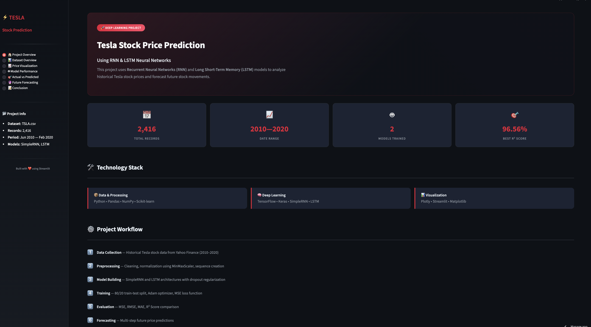
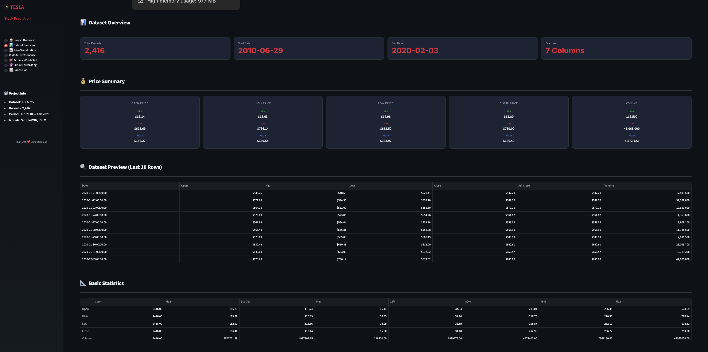
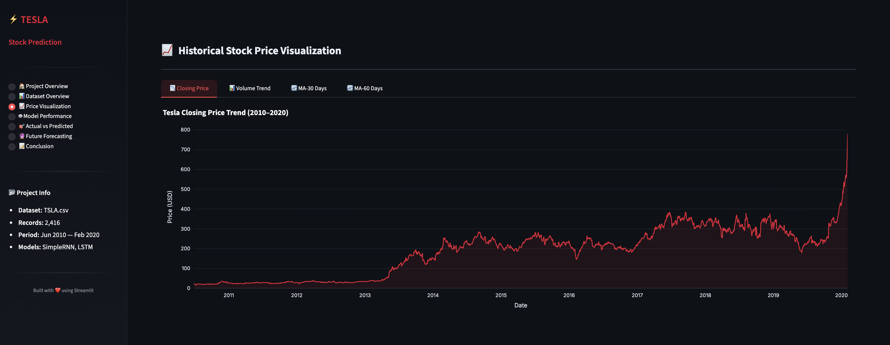
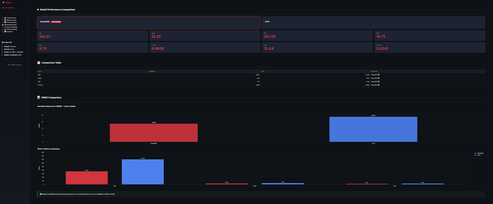
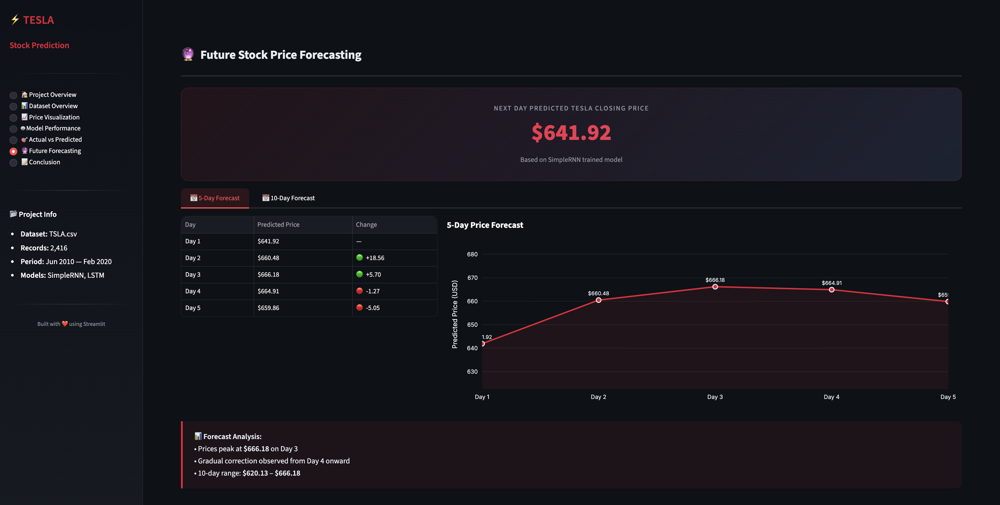

# ⚡ Tesla Stock Price Prediction using Deep Learning

An end-to-end Deep Learning project that predicts Tesla stock prices using **SimpleRNN** and **LSTM** neural networks. The project covers data preprocessing, time-series forecasting, model evaluation, and deployment through an interactive Streamlit dashboard with advanced visualizations.


---

🌐 **Live Demo:** [Tesla Stock Price Prediction App](https://teslastockpricepredictionap.streamlit.app/)

---

## 📸 Screenshots

### Home Dashboard



### Dataset Overview



### Historical Price Visualization



### Model Performance Comparison



### Future Forecasting



---

## 🔍 Problem Statement

Stock market forecasting is one of the most challenging applications of Machine Learning and Deep Learning due to highly dynamic market conditions.

Tesla is among the most actively traded technology stocks. Investors and analysts often seek methods to predict future stock prices based on historical trends.

**This project aims to answer:**

*Can Deep Learning models such as SimpleRNN and LSTM accurately predict future Tesla stock prices using historical market data?*

---

## 🧠 Project Workflow

```text
📂 Tesla Historical Stock Data
        ↓
🧹 Data Cleaning & Preprocessing
        ↓
📊 Exploratory Data Analysis
        ↓
⚙️ Feature Scaling (MinMaxScaler)
        ↓
🔄 Time Series Sequence Creation
        ↓
🧠 Model Training
      ├── SimpleRNN
      └── LSTM
        ↓
📈 Model Evaluation
        ↓
🔮 Future Price Forecasting
        ↓
🚀 Streamlit Deployment
```

---

## 📁 Project Structure

```text
Tesla_Stock_Prediction/
│
├── app.py
├── model.h5
├── scaler.pkl
├── TSLA.csv
├── Tesla_Stock_Prediction.ipynb
├── requirements.txt
├── README.md
│
├── Screenshots/
│   ├── home.png
│   ├── dataset.png
│   ├── visualization.png
│   ├── performance.png
│   └── forecast.png
│
└── models/
    ├── SimpleRNN
    └── LSTM
```

---

## 📊 Dataset

The project uses Tesla historical stock market data containing daily trading information.

### Features

| Column    | Description            |
| --------- | ---------------------- |
| Date      | Trading Date           |
| Open      | Opening Price          |
| High      | Highest Price          |
| Low       | Lowest Price           |
| Close     | Closing Price          |
| Adj Close | Adjusted Closing Price |
| Volume    | Total Trading Volume   |

### Dataset Statistics

* Records: 2,400+ rows
* Period Covered: 2010 – 2020
* Company: Tesla Inc. (TSLA)

---

## ⚙️ Data Preprocessing

The following preprocessing steps were performed:

* Missing value handling
* Date formatting
* Feature selection (Close Price)
* MinMax Scaling
* Sequence generation using previous 60 days
* Train-Test Split

Example:

last_60_days = scaled_data[-60:]
future_input = last_60_days.reshape(1,60,1)


---

## 🤖 Deep Learning Models

### 1. SimpleRNN

A Recurrent Neural Network designed to learn sequential patterns from stock price history.

### 2. LSTM

Long Short-Term Memory network capable of learning long-range dependencies in time-series data.

---

## 📈 Model Performance

| Metric   | SimpleRNN | LSTM   |
| -------- | --------- | ------ |
| MSE      | 183.57    | 351.56 |
| RMSE     | 13.55     | 18.75  |
| MAE      | 8.75      | 12.44  |
| R² Score | 0.9656    | 0.9341 |

### 🏆 Best Model

**SimpleRNN**

Reason :

* Lowest RMSE
* Lowest MAE
* Highest R² Score
* Better prediction accuracy on Tesla stock dataset

---

## 📉 Historical Stock Analysis

The dashboard includes :

* Closing Price Trend
* Trading Volume Analysis
* 30-Day Moving Average
* 60-Day Moving Average
* Interactive Plotly Visualizations

---

## 🔮 Future Forecasting

The trained model predicts future Tesla stock prices using the latest 60 days of stock data.

### Example Forecast

| Day   | Predicted Price ($) |
| ----- | ------------------- |
| Day 1 | 641.92              |
| Day 2 | 660.48              |
| Day 3 | 666.18              |
| Day 4 | 664.91              |
| Day 5 | 659.86              |

The Streamlit application provides:

* Next-Day Prediction
* 5-Day Forecast
* 10-Day Forecast
* Forecast Trend Visualization

---

## 🖥️ Streamlit Features

### 🏠 Project Overview

* Project introduction
* Technology stack
* Workflow explanation

### 📊 Dataset Overview

* Dataset statistics
* Summary metrics
* Data preview

### 📈 Price Visualization

* Historical trends
* Moving averages
* Volume analysis

### 🤖 Model Performance

* Model comparison
* Error metrics
* Performance charts

### 🎯 Actual vs Predicted

* Prediction accuracy visualization
* Comparative analysis

### 🔮 Future Forecasting

* Next-day prediction
* Multi-day forecasting
* Interactive forecast charts

### 📝 Conclusion

* Findings
* Future improvements
* Project summary

---

## 🚀 Installation

### Clone Repository

git clone https://github.com/yourusername/Tesla-Stock-Prediction.git

cd Tesla-Stock-Prediction

### Install Dependencies

pip install -r requirements.txt

### Run Application

streamlit run app.py

Open the local host 

---

## 🛠️ Tech Stack

| Category        | Technology         |
| --------------- | ------------------ |
| Language        | Python             |
| Deep Learning   | TensorFlow, Keras  |
| Data Processing | Pandas, NumPy      |
| Visualization   | Plotly, Matplotlib |
| Scaling         | Scikit-Learn       |
| Deployment      | Streamlit          |

---

## 🔮 Future Improvements

* Real-time stock market integration
* News sentiment analysis
* Transformer-based forecasting models
* Multi-stock portfolio prediction
* Live prediction API deployment
* Reinforcement Learning for trading strategies

---

## 👤 Author

**Name**: ALVIRA PARVEEN  
🔗 [LinkedIn](https://www.linkedin.com/in/alvira-parveen-78022536b)  
🌐 [GitHub](https://github.com/Alvira-Parveen)

---

## 📄 License

This project is licensed under the MIT License — see the [LICENSE](LICENSE) file for details.

---

⭐ If you found this project useful, consider giving it a star.
